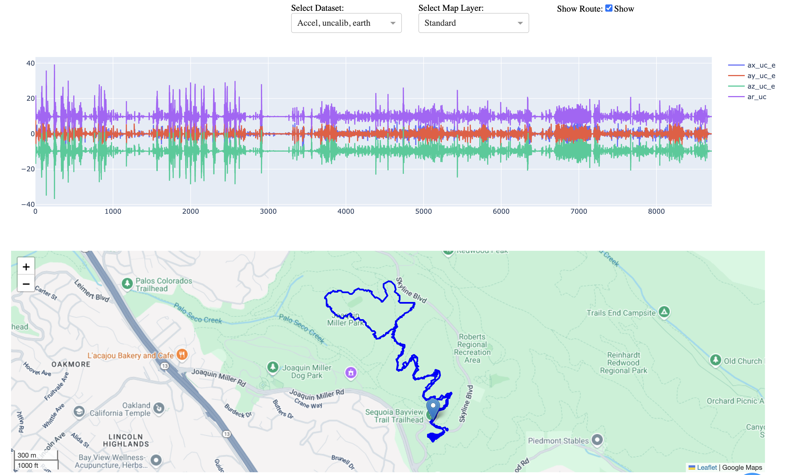

# Mountain Bike Data Tracker and Visualizer

Cool metrics and a visualization tool for serious mountain bike riders. Works with a smartphone and the Sensor Logger app to collect GPS, accelerometer, and gyroscope data.



## Background and Goals

The basic idea is to provide metrics for serious mountain bike riders that are both motivating and genuinely useful for the purpose of coaching/improving/getting sendy. These include:

1. Jump airtime and distance
1. Impact and cornering G-forces
1. Overall avg ride intensity
1. Avg cornering intensity
1. Most common geo metrics found on Strava

Other metrics that I haven't implemented yet:
1. Boost intensity
1. Whip angle and duration
1. Resolving left and right cornering
1. Crash detection

There is an iOS app in the works, but in the meantime I wanted to open source some of the code, especially the visualizer.

## Quick Start

### Prerequisites
- Python 3.8 or higher
- pyenv (recommended for version management)
- smartphone

### Python Setup

```bash
# Clone repository
git clone https://github.com/es65/MtbViz
cd MtbViz

# Install (if needed) and Set Python version 3.8-3.12:
pyenv install 3.12.0
pyenv local 3.12.0

# Create virtual environment
python -m venv .venv
source .venv/bin/activate

# Install in editable mode
pip install -e .

# Run tests
python tests/test_requirements.py
```

### Install and Set Up Sensor Logger

Sensor Logger collects the accelerometer, gyroscope, and GPS data that feeds this module.

1. Download the Sensor Logger app to your phone
   - iPhone: https://apps.apple.com/us/app/sensor-logger/id1531582925
   - Android: https://play.google.com/store/apps/details?id=com.kelvin.sensorapp&hl=en_US
2. Set app security to **_Allow Location Access ALWAYS_** and **_Enable Precise Location_**. This is necessary so the app can continue to record in the background.
3. Set sampling frequency: Logger > Gear Icon > Sampling Frequencies: change accelerometer etc to 20 Hz. Leave others at default values.
4. From the Logger screen, enable the following: Accelerometer, Gravity, Gyroscope, Orientation, Compass, Barometer, and Location.
5. Before a ride: from the Logger screen, click "Start Recording".
6. During a ride: you can start Strava and use other apps without trouble--Sensor Logger continues to run and record data in the background. Just don't close the app. After dozens of rides using this app, I have not noticed any serious impact on iPhone battery life.
7. After a ride: click "End Recording". Date files are saved locally on your phone and are shown in the Recordings tab. Whenever convenient (i.e. when you have good signal or WiFi), click on the data file for your ride and click "Export". Keep the default settings and click "Export Recording". Save to `MtbViz/data/raw`.

### Usage

#### Command Line Interface

**TLRD: Process and Visualize Single Ride**

Once you've recorded a ride (or just demo one of the files in `data_examples/`):

```bash
process --input data/raw/ride.zip && viz --input data/processed/ride.parquet
```
(Just replace "ride" with the actual name of your file obviously.)

**The details:**

```bash
# Process a single ride
process --input data/raw/ride.zip

# Process with custom output directory
process --input ride.zip --output my_processed_data

# Process all rides in a directory
process --input data/raw --batch

# Process with custom settings
process --input ride.zip --downsample-freq 10 --verbose

# Process with custom jump detection
process --input ride.zip --jump-threshold 2.0 --jump-min-consecutive 3
```

**Common Options:**
- `--input, -i`: Path to zip file or directory (required)
- `--output, -o`: Output directory (default: `data/processed`)
- `--batch, -b`: Process all rides in input directory
- `--overwrite, -f`: Reprocess and overwrite existing output files
- `--downsample-freq`: Resample frequency in Hz
- `--verbose, -v`: Enable detailed logging
- `--jump-threshold`: Jump detection threshold
- `--jump-min-consecutive`: Minimum consecutive points for jump detection

#### Python API

For more control and customization, use the Python API:

```python
from mtb.src.pipeline import Pipeline, ProcessingConfig

# Basic usage with default settings
config = ProcessingConfig()
pipeline = Pipeline(config)

# Process a single ride
result = pipeline.process_ride("data/raw/ride.zip")

# Access results
print(f"Duration: {result['summary_metrics']['duration_hr']:.2f} hours")
print(f"Distance: {result['summary_metrics']['distance_haversine']:.2f} miles")
print(f"Elevation gain: {result['summary_metrics']['elevation_gain']:.0f} feet")
print(f"Jumps detected: {len(result['jump_events_df']) if result['jump_events_df'] is not None else 0}")
```

**Custom Configuration:**

```python
# Create custom configuration
config = ProcessingConfig(
    downsample_freq=10,           # 10 Hz resampling
    jump_threshold=2.0,           # Custom jump detection
    save_intermediate=True,       # Save intermediate files
    verbose=True,                 # Detailed logging
    processed_dir="my_output"     # Custom output directory
)

pipeline = Pipeline(config)
result = pipeline.process_ride("data/raw/ride.zip")
```

**Batch Processing:**

```python
# Process multiple rides
results = pipeline.process_multiple_rides("data/raw")

# Analyze results
for result in results:
    ride_name = result['output_files']['processed'].stem
    duration = result['summary_metrics']['duration_hr']
    distance = result['summary_metrics']['distance_haversine']
    print(f"{ride_name}: {duration:.2f}h, {distance:.2f}mi")
```

**Accessing Output Files:**

```python
result = pipeline.process_ride("data/raw/ride.zip")

# Output files created:
print("Files created:")
for file_type, file_path in result['output_files'].items():
    if file_path:
        print(f"  {file_type}: {file_path}")

# File types:
# - raw: Raw sensor data (if save_intermediate=True)
# - resampled: Resampled data (if save_intermediate=True)  
# - processed: Final processed data with features
# - summary: JSON file with ride metrics
# - jumps: Jump events data (if jumps detected)
```

**Working with Results:**

```python
# Access summary metrics
metrics = result['summary_metrics']
print(f"Ride Summary:")
print(f"  Duration: {metrics['duration_hr']:.2f} hours")
print(f"  Distance: {metrics['distance_haversine']:.2f} miles")
print(f"  Elevation gain: {metrics['elevation_gain']:.0f} feet")
print(f"  Average speed: {metrics['avg_speed_mph']:.1f} mph")
print(f"  Overall intensity: {metrics['avg_overall_intensity']:.2f}")

# Access jump events
if result['jump_events_df'] is not None:
    jumps = result['jump_events_df']
    print(f"\nJump Analysis:")
    print(f"  Total jumps: {len(jumps)}")
    print(f"  Total airtime: {jumps['airtime_s'].sum():.1f} seconds")
    print(f"  Longest jump: {jumps['airtime_s'].max():.2f} seconds")
    print(f"  Average distance: {jumps['distance_ft'].mean():.1f} feet")

# Access processed data
processed_df = result['processed_df']
print(f"\nData shape: {processed_df.shape}")
print(f"Columns: {list(processed_df.columns)}")
```

#### Visualization

After processing your data, you can visualize it using the interactive web app:

```bash
# Launch the visualization app
viz --input data/processed/ride.parquet
```

The app provides:
- Interactive time series plots of sensor data
- Map view with GPS track and jump locations
- Real-time hover synchronization between plot and map
- Multiple data views (acceleration, gyroscope, etc.)
